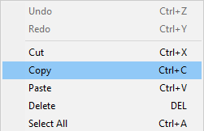

# cp

Windows 中最常用的指令莫过于复制黏贴了，这在 Unix 下也一样简单~



## 创建单个文件备份（重复文件）

如果 `empty-file.backup` 已经存在，那么它将会被**覆盖**，而程序不会报错。

```bash
$ ls
empty-file
$ cp empty-file empty-file.backup
$ ls
empty-file  empty-file.backup
```

## 复制单个文件到指定目录下

因为这里的 `dst-dir` 是一个文件夹，所以 `cp` 会自动识别并在该目录下创建**与原文件名一致**的文件。

```bash
$ ls -l
total 4
drwxr-xr-x 2 nichenji cstudent 4096 Jan  7 07:29 dst-dir
-rw-r--r-- 1 nichenji cstudent    0 Jan  7 07:24 empty-file
-rw-r--r-- 1 nichenji cstudent    0 Jan  7 07:26 empty-file.backup
$ ls dst-dir/
$ cp empty-file dst-dir/
$ ls dst-dir/
empty-file
```

## 复制单个文件到指定目录下并_重命名_

这里指定了目标位置的文件名 dst-dir/`hello-world-file`，`cp` 会在该目录下创建以该文件名命名的文件。

```bash
$ ls dst-dir/
$ cp empty-file dst-dir/hello-world-file
$ ls dst-dir/
hello-world-file
```

## 复制多个文件

用法：cp [OPTION]... SOURCE**...** DIRECTORY  
注意第二个标粗体的...，代表 SOURCE 文件可以是多个，只有最后一个是目标文件夹即可。

```bash
$ ls dst-dir/
$ ls
dst-dir  empty-file  empty-file.backup
$ cp empty-file empty-file.backup dst-dir/
$ ls dst-dir/
empty-file  empty-file.backup
```

## 复制文件夹

`cp` 默认只会复制文件，忽略文件夹。如果要复制文件夹，你必须加上 `-r` 这个 flag.

```bash
$ ls
dst-dir  empty-file  empty-file.backup
$ cp dst-dir/ dst-dir-copy/
cp: omitting directory 'dst-dir/'
$ ls
dst-dir  empty-file  empty-file.backup
$ ls dst-dir/
empty-file  empty-file.backup
$ cp -r dst-dir/ dst-dir-copy/
$ ls
dst-dir  dst-dir-copy  empty-file  empty-file.backup
$ ls dst-dir-copy/
empty-file  empty-file.backup
```