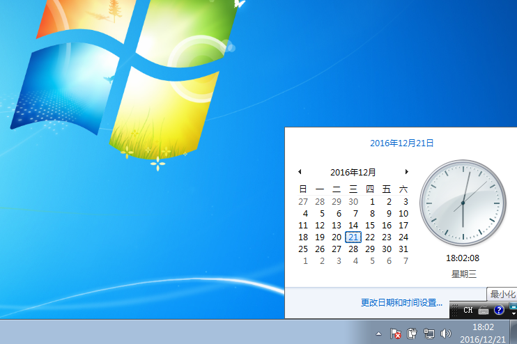

# date

码农的生活总是昼夜颠倒的，这导致像我这样的人总记不住时间，在 Windows 里我习惯时不时地瞄一眼屏幕右下方，就像这样（图片来自网络）



可是在 Unix 中，我经常全屏和黑漆漆的命令行打交道，懒得切换页面看时间。（归根结底还是懒……）那么就可以用`date`这个命令来显示当前时间：

```bash
$ date
Sun Jan  6 21:20:07 EST 2019
```