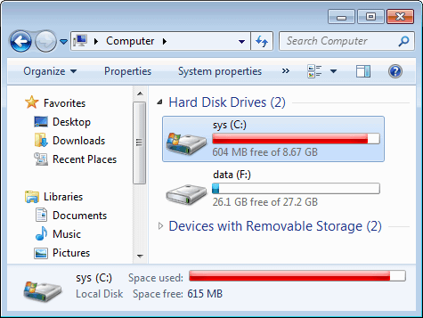

# df

对应 Windows 中的`我的电脑`：



显示当前磁盘挂载情况，以及剩余空间大小。我们通常在这条命令后加上 `-h` flag 来显示更友善的大小格式。（学校服务器磁盘比较多，每个磁盘都挂载在不同的目录下）

```bash
$ df -h
Filesystem             Size  Used Avail Use% Mounted on
udev                    32G     0   32G   0% /dev
tmpfs                  6.3G  3.7M  6.3G   1% /run
/dev/md0p2              48G   45G  2.2G  96% /
tmpfs                   32G     0   32G   0% /dev/shm
tmpfs                  5.0M     0  5.0M   0% /run/lock
tmpfs                   32G     0   32G   0% /sys/fs/cgroup
/dev/md0p5              26G   45M   26G   1% /tmp
/dev/md0p4              36G  7.3G   27G  22% /var
/dev/md0p6              15G  791M   14G   6% /data
homesrv:/h/u16         1.2T  236G  887G  21% /h/u16
homesrv:/h/u1          1.2T  385G  738G  35% /h/u1
homesrv:/h/u5          1.2T  263G  860G  24% /h/u5
homesrv:/h/u13         1.2T  292G  831G  26% /h/u13
tmpfs                  6.3G     0  6.3G   0% /run/user/11597
homesrv:/h/u12         1.2T  287G  836G  26% /h/u12
homesrv:/h/u10         1.2T  263G  860G  24% /h/u10
tmpfs                  6.3G     0  6.3G   0% /run/user/11474
tmpfs                  6.3G     0  6.3G   0% /run/user/11438
homesrv:/h/u17         1.2T  265G  858G  24% /h/u17
homesrv:/h/u8          1.2T  277G  846G  25% /h/u8
tmpfs                  6.3G     0  6.3G   0% /run/user/30163
tmpfs                  6.3G     0  6.3G   0% /run/user/8331
tmpfs                  6.3G     0  6.3G   0% /run/user/11473
tmpfs                  6.3G     0  6.3G   0% /run/user/33652
tmpfs                  6.3G     0  6.3G   0% /run/user/40593
tmpfs                  6.3G     0  6.3G   0% /run/user/36721
homesrv:/h/u3          1.2T  265G  859G  24% /h/u3
homesrv:/h/u14         1.2T  267G  857G  24% /h/u14
tmpfs                  6.3G     0  6.3G   0% /run/user/35125
tmpfs                  6.3G     0  6.3G   0% /run/user/710
tmpfs                  6.3G     0  6.3G   0% /run/user/11533
tmpfs                  6.3G     0  6.3G   0% /run/user/35294
tmpfs                  6.3G     0  6.3G   0% /run/user/37035
tmpfs                  6.3G     0  6.3G   0% /run/user/11357
homesrv:/h/u6          1.2T  277G  846G  25% /h/u6
tmpfs                  6.3G     0  6.3G   0% /run/user/44509
tmpfs                  6.3G     0  6.3G   0% /run/user/41906
tmpfs                  6.3G     0  6.3G   0% /run/user/30294
tmpfs                  6.3G     0  6.3G   0% /run/user/37401
tmpfs                  6.3G     0  6.3G   0% /run/user/39974
tmpfs                  6.3G     0  6.3G   0% /run/user/40461
tmpfs                  6.3G     0  6.3G   0% /run/user/44508
tmpfs                  6.3G  4.0K  6.3G   1% /run/user/40289
tmpfs                  6.3G     0  6.3G   0% /run/user/30518
homesrv:/h/u11         1.2T  233G  890G  21% /h/u11
tmpfs                  6.3G     0  6.3G   0% /run/user/30134
tmpfs                  6.3G     0  6.3G   0% /run/user/43727
homesrv:/h/u7          1.2T  248G  875G  23% /h/u7
homesrv:/h/u0          1.2T   65G  1.1T   6% /h/u0
tmpfs                  6.3G     0  6.3G   0% /run/user/600
tmpfs                  6.3G     0  6.3G   0% /run/user/6250
tmpfs                  6.3G     0  6.3G   0% /run/user/939
tmpfs                  6.3G     0  6.3G   0% /run/user/36643
homesrv:/h/u15         1.2T  251G  872G  23% /h/u15
tmpfs                  6.3G     0  6.3G   0% /run/user/935
homesrv:/h/u2          1.2T  356G  767G  32% /h/u2
tmpfs                  6.3G     0  6.3G   0% /run/user/300
tmpfs                  6.3G     0  6.3G   0% /run/user/6881
tmpfs                  6.3G     0  6.3G   0% /run/user/830
tmpfs                  6.3G     0  6.3G   0% /run/user/655
tmpfs                  6.3G     0  6.3G   0% /run/user/726
tmpfs                  6.3G     0  6.3G   0% /run/user/40250
tmpfs                  6.3G     0  6.3G   0% /run/user/5734
tmpfs                  6.3G     0  6.3G   0% /run/user/669
pigeon:/export/mail    118G  5.7G  111G   5% /s/mail
tmpfs                  6.3G     0  6.3G   0% /run/user/42489
tmpfs                  6.3G     0  6.3G   0% /run/user/36733
fs4:/export0/appspace  5.5T  5.3T  212G  97% /s/appspace
```