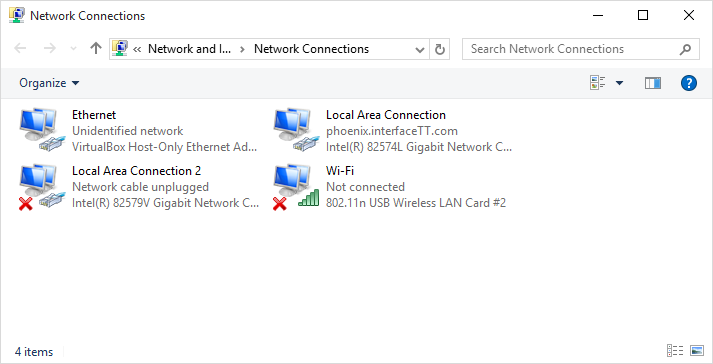

# ifconfig

对应 Windows 中的`网络共享中心`：



显示当前活跃的网络连接信息，主要用来看设备的 ip 地址以及 MAC 地址。

```bash
$ ifconfig
eth0      Link encap:Ethernet  HWaddr 00:25:90:5a:2a:02
          inet addr:128.100.31.200  Bcast:128.100.31.255  Mask:255.255.255.0
          inet6 addr: fe80::225:90ff:fe5a:2a02/64 Scope:Link
          UP BROADCAST RUNNING MULTICAST  MTU:1500  Metric:1
          RX packets:834718767 errors:0 dropped:1631414 overruns:993 frame:0
          TX packets:983664109 errors:0 dropped:0 overruns:0 carrier:0
          collisions:0 txqueuelen:1000
          RX bytes:557689808295 (557.6 GB)  TX bytes:1152034651284 (1.1 TB)
          Memory:dff20000-dff3ffff

eth1      Link encap:Ethernet  HWaddr 00:25:90:5a:2a:03
          inet addr:192.168.1.200  Bcast:192.168.1.255  Mask:255.255.255.0
          inet6 addr: fe80::225:90ff:fe5a:2a03/64 Scope:Link
          UP BROADCAST RUNNING MULTICAST  MTU:1500  Metric:1
          RX packets:8568470 errors:0 dropped:0 overruns:0 frame:0
          TX packets:43499383 errors:0 dropped:0 overruns:0 carrier:0
          collisions:0 txqueuelen:1000
          RX bytes:580635402 (580.6 MB)  TX bytes:62390089478 (62.3 GB)
          Memory:dff60000-dff7ffff

lo        Link encap:Local Loopback
          inet addr:127.0.0.1  Mask:255.0.0.0
          inet6 addr: ::1/128 Scope:Host
          UP LOOPBACK RUNNING  MTU:65536  Metric:1
          RX packets:2820987923 errors:0 dropped:0 overruns:0 frame:0
          TX packets:2820987923 errors:0 dropped:0 overruns:0 carrier:0
          collisions:0 txqueuelen:1000
          RX bytes:233420505104 (233.4 GB)  TX bytes:233420505104 (233.4 GB)
```