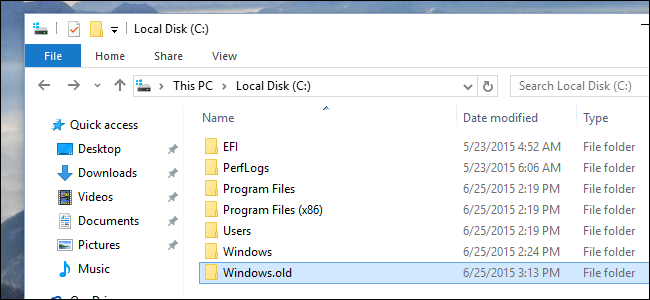

# ls

在 Windows 中如果你想知道一个文件夹底下有什么东西，那么你只需要双击点开他，然后内容就会呈现在你眼前，就像这样（图片来自网络）



这仰赖于 Windows 强大的 GUI 界面，让这一切看起来如此赏心悦目。下面我们转战 Unix 阵营，对于非桌面版的 Unix 或是通过 `ssh` 远程连接时，这个简单的操作就不像 Windows 那么友好了。

`ls` 命令可以列出当前工作路径下的所有文件和文件夹，以下是一些常用的 flag 和它们的基本用法:

| flag | 作用 |
|------|------|
| -a | 显示以 `.` 开头的隐藏文件 |
| -l | 显示详细信息（包括权限、大小、修改时间等） |
| -F | 文件名结尾显示不同的符号，表示不同的文件类型（`/`表示文件夹，`@`表示symlink，`*`表示可执行文件） |
| -h | 文件大小用更友善的格式显示，比如 1K, 234M, 2G |

## 默认 flag

```bash
$ ls
404.html       assignments  feedback.html  index.html  labs	 mkweb.sh  remark.pdf  syllabus  uncategorized
announcements  calendar     grades	   lab	       lectures  old	   static      tests
```

## 常用 flag

```bash
$ ls -l
total 124
-rw-rw-r--  1 reid     cs209hi  3652 Dec 15  2017 404.html
drwxrwxr-x  2 reid     cs209hi  4096 Sep  4  2017 announcements
drwxrwxr-x  6 reid     cs209hi  4096 Nov 22  2017 assignments
drwxrwxr-x  2 reid     cs209hi  4096 Sep  4  2017 calendar
-rw-rw-r--  1 reid     cs209hi  5195 Dec 15  2017 feedback.html
drwxrwxr-x  2 reid     cs209hi  4096 Sep  4  2017 grades
-rw-rw-r--  1 reid     cs209hi  6058 Dec 15  2017 index.html
drwxrwxr-x  3 liudavid cs209hi  4096 Sep  7  2017 lab
drwxrwxr-x  3 reid     cs209hi  4096 Nov 21  2017 labs
drwxrwxr-x 15 reid     cs209hi  4096 Nov 28  2017 lectures
-rwxrw-r--  1 reid     cs209hi   263 Dec 15  2017 mkweb.sh
drwxrwsr-x  2 reid     cs209hi  4096 Sep  1  2017 old
-rw-r--r--  1 mcraig   cs209hi 52399 Sep  4 14:23 remark.pdf
drwxrwxr-x  5 reid     cs209hi  4096 Sep  4  2017 static
drwxrwxr-x  2 reid     cs209hi  4096 Sep  4  2017 syllabus
drwxrwxr-x  3 reid     cs209hi  4096 Oct 31  2017 tests
drwxrwxr-x  3 reid     cs209hi  4096 Sep  4  2017 uncategorized
```

## flag 组合

```bash
$ ls -alFh
total 132K
drwxrwsr-x 14 root     cs209hi 4.0K Sep  4 14:23 ./
drwxr-xr-x  6 root     csc209h 4.0K Apr 22  2014 ../
-rw-rw-r--  1 reid     cs209hi 3.6K Dec 15  2017 404.html
drwxrwxr-x  2 reid     cs209hi 4.0K Sep  4  2017 announcements/
drwxrwxr-x  6 reid     cs209hi 4.0K Nov 22  2017 assignments/
drwxrwxr-x  2 reid     cs209hi 4.0K Sep  4  2017 calendar/
-rw-rw-r--  1 reid     cs209hi 5.1K Dec 15  2017 feedback.html
drwxrwxr-x  2 reid     cs209hi 4.0K Sep  4  2017 grades/
-rw-rw-r--  1 reid     cs209hi 6.0K Dec 15  2017 index.html
drwxrwxr-x  3 liudavid cs209hi 4.0K Sep  7  2017 lab/
drwxrwxr-x  3 reid     cs209hi 4.0K Nov 21  2017 labs/
drwxrwxr-x 15 reid     cs209hi 4.0K Nov 28  2017 lectures/
-rwxrw-r--  1 reid     cs209hi  263 Dec 15  2017 mkweb.sh*
drwxrwsr-x  2 reid     cs209hi 4.0K Sep  1  2017 old/
-rw-r--r--  1 mcraig   cs209hi  52K Sep  4 14:23 remark.pdf
drwxrwxr-x  5 reid     cs209hi 4.0K Sep  4  2017 static/
drwxrwxr-x  2 reid     cs209hi 4.0K Sep  4  2017 syllabus/
drwxrwxr-x  3 reid     cs209hi 4.0K Oct 31  2017 tests/
drwxrwxr-x  3 reid     cs209hi 4.0K Sep  4  2017 uncategorized/
```