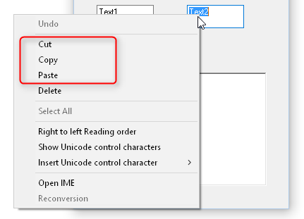

# mv

Windows 中第二常用的指令就是`剪切`了，它对应 Unix 中的 `mv` 命令。



## 重命名文件/文件夹

```bash
$ ls -lF
total 4
drwxr-xr-x 2 nichenji cstudent 4096 Jan  7 10:28 bar-dir/
-rw-r--r-- 1 nichenji cstudent    0 Jan  7 10:28 foo
$ mv foo renamed-foo
$ mv bar-dir/ renamed-bar-dir/
$ ls -lF
total 4
drwxr-xr-x 2 nichenji cstudent 4096 Jan  7 10:28 renamed-bar-dir/
-rw-r--r-- 1 nichenji cstudent    0 Jan  7 10:28 renamed-foo
```

## 剪切并粘贴

用法和 `cp` 类似，它可以一次剪切粘贴多个文件，也能粘贴并重命名，这里就不过多演示了。

```bash
$ ls
renamed-bar-dir  renamed-foo
$ touch example-file
$ mv example-file renamed-bar-dir/
$ ls
renamed-bar-dir  renamed-foo
$ ls renamed-bar-dir/
example-file
```