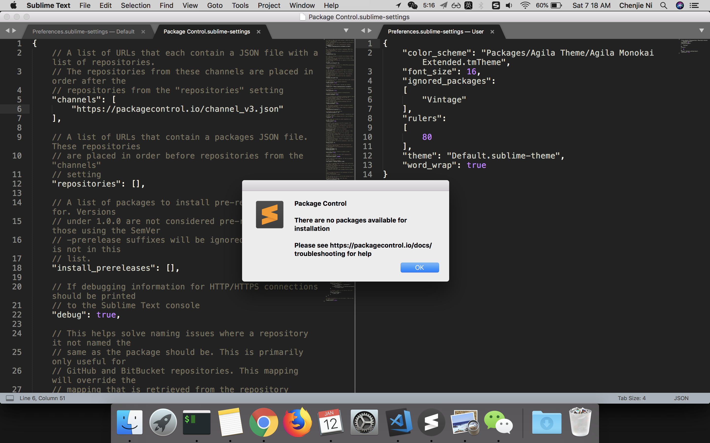
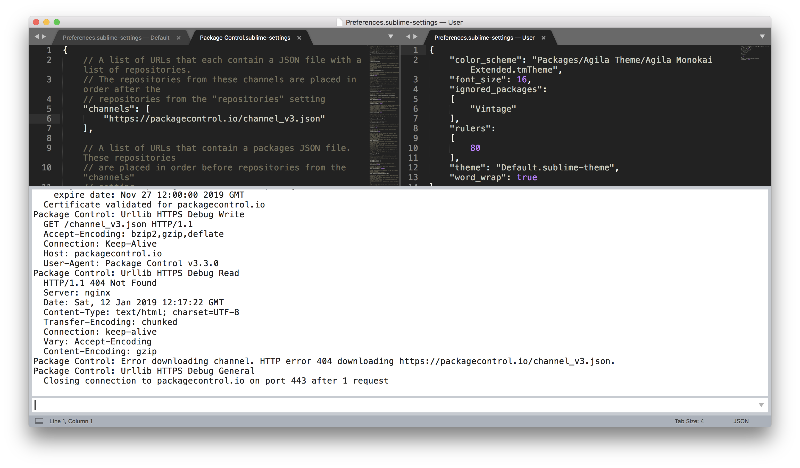
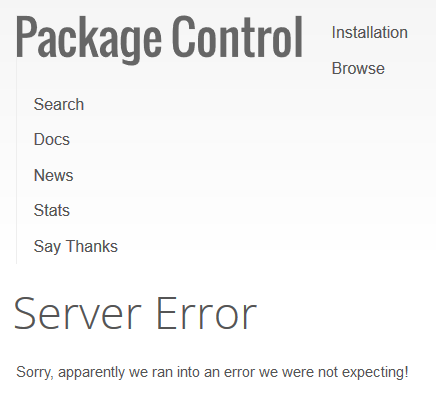
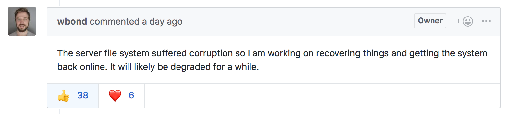
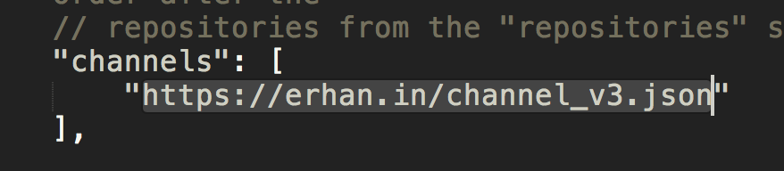

# Sublime 服务器宕机

今天一时兴起，想给 ST3 在 macOS 上一次重生的机会，上次因为 markdown 编辑繁杂、不能满足我的需求问题被我一气之下卸载了。dmg 安装完成之后想装几个插件来优化一下主题和 git 体验，结果不幸踩坑，这黑锅 Sublime 网站后台运维一定得背。

## 耗时

四小时 😡

## 症状

## 排查

## 原因

## 临时解决方式

