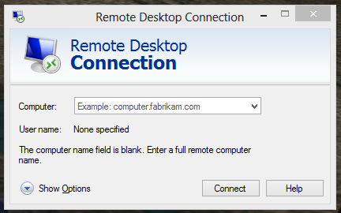

# 写在开头

相信大家用过或至少听说过`远程桌面`这个名词，顾名思义，它代表远程操控一台 Windows 的电脑桌面。

在 Unix 下同样有类似东西的存在，只不过对于不以 GUI 界面见长的 Unix 来说，像 Windows 一样传输图像画面未免有些奢侈以及 overkill. Unix 哲学告诉你，**一切**在 Windows 下的图形界面能做的事情，我 Unix 用**纯文本**一样能做，并且我要做的比 Windows 更高效，更节省带宽，更简单。（可惜……理想是美好的，现实却是骨感的）

欢迎使用 99.99% Unix/Linux 开发者都喜爱的 `ssh` 命令。([0.01%](http://forums.justlinux.com/showthread.php?24382-I-hate-SSH!!!-Help-needed-before-I-go-insane))

## SSH 是什么？

SSH 的全称是 Secure Shell，直译为 安全贝壳🐚（哈哈，这名字有点中二，只有我这么翻译）。

## SSH 能做什么？

使用本机操控远程 Unix 终端。你可以做一切你想做的事，就像你坐在远端电脑面前一样。
