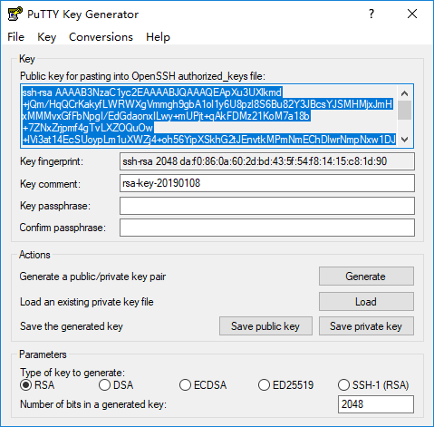
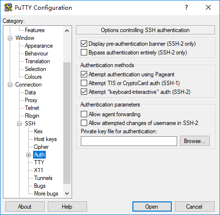

# 进阶技能

每次打开还得输入密码你说烦不烦（嗯，我也觉得烦），那能不能不输密码？答案是**可以的**，使用公钥和私钥来验证用户省份，具体细节有些复杂，我墙裂推荐大家观看以下 YouTube 视频（国内朋友需要科学上网）：

6H_9l9N3IXU

## 生成公钥和私钥

首先我们需要打开 PuTTY Key Generator 来生成一对公钥和私钥，这个程序应该是和 PuTTY 一并安装的，参数选择 RSA，长度2048位即可。

> 注意在空白区域不断移动鼠标来加快生成随机数



* 公钥：即上图中选中的以 `ssh-rsa` 开头的字符串，将它复制黏贴进记事本并保存起来。
* 私钥：点击 `Save private key` 将私钥保存到你指定的目录下，后缀名为 `.ppk`，注意私钥一定**不能**分享或公开，如果别人有了你的私钥，那么相当于就能冒充你的身份。

## 本地 PuTTY 配置

密钥生成了之后我们要回到 PuTTY 中，告诉它我们想用私钥来代替密码做身份验证。点击左侧 `Connection -> SSH -> Auth` 来到私钥选择界面。



点击 `Browse...` 并选择刚才保存的 `.ppk` 私钥文件，然后在连接之前记得回到 `Session` 中保存当前配置。至此我们就完成了本地计算机的配置，下面我们要到远程计算机中配置 `authorized_keys`.

## 远端 `authorized_keys` 配置

我们需要告诉远程计算机，允许持有该公钥的用户使用私钥进行验证。具体方法是将**公钥**（也就是之前以 `ssh-rsa` 开头的字符串）添加到 `~/.ssh/authorized_keys` 中。

先用普通方式输入密码连接 `ssh`，然后执行以下命令，将 `<你的公钥>` 替换为 `ssh-rsa AAAAB3NzaC1yc2EAAAABJQAAAQEApXu3UXlkmd+jQm/HqQCrKakyfLWRWXgVmmgh9gbA1ol1y6U8pzl8S6Bu82Y3JBcsYJSMHMjxJmHxMMMvxGfFbNpgI/EdGdaonxILwy+mUPjt+qAkFDMz21KoM7a18b+7ZNxZrjpmf4gTvLXZOQuOw+lVi3at14EcSUoypLm1uXWZj4+oh56YipXSkhG2tJEnvtkMPmNmEChDlwrNmpNxw1DJhpbx94BBxuJU9bNIJAZeXnedP3cG81PF7LWlLlc2qZy/tUtE3wFA3SOHI8tdTJaQ6EOIIEddek7o+NX9d45BDqWlF37ai47U+TamKISNh/X5auf5pHpllr+UlmS+nw== rsa-key-20190108`

```bash
$ echo '<你的公钥>' >> .ssh/authorized_keys
```

恭喜你，进阶技能get!