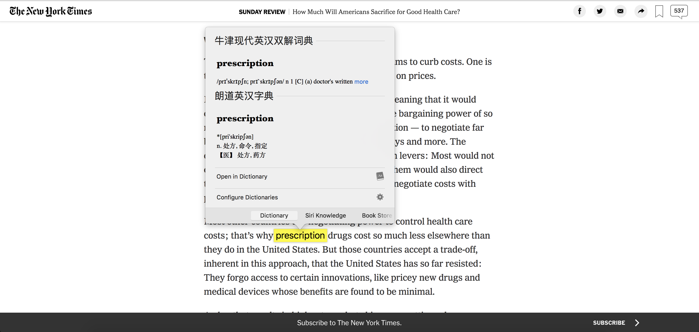

# 扩展系统自带字典

macOS 自带的用来翻译的那些字典、词典真的非常优秀，笔者已经对它们有重度依赖了，唯一的缺点就是系统自带的词典较少，有些词只有 wiki 有，但 wiki 通常又只有英文的。所以这个教程就教大家如何自己添加词典，例如牛津英汉双解词典、朗道英汉词典等。

## Credit

https://www.douban.com/group/topic/9591106/

## 效果展示

## 所需软件

1. [DictUnifier](https://github.com/jjgod/mac-dictionary-kit/releases/download/v2.1/DictUnifier-2.1.zip)
2. [词典包](http://download.huzheng.org/zh_CN/index.html)

## 安装步骤（电脑需保持开机1小时左右）

1. 下载 DictUnifier
2. 下载 tarbal 格式词典包 
3. 将 tarbal 词典包拖进 DictUnifier
4. 用你**足够**的耐心等它走完
5. 词典包安装后，打开 Dictionary -> Preferences... -> 勾选你需要使用词典包即可。
6. Enjoy!