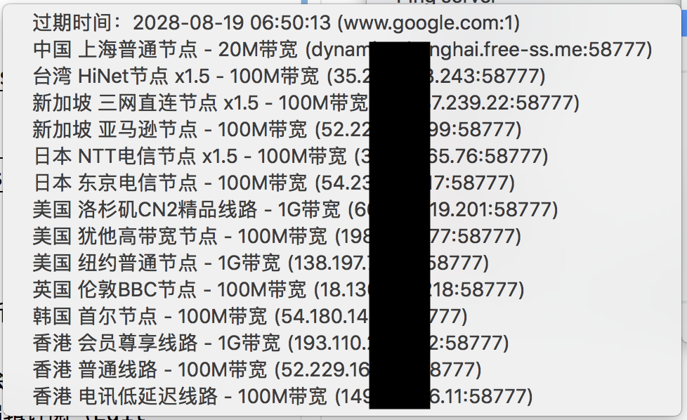

# 科学上网

什么？你竟然还不知道科学上网是什么？那你至少听说过以下几个词中的一个吧：`酸酸乳`，`梯子`，`爬梯`，`筛子`，`翻越长城`，`出墙`…… 你这是在逼我的网站被 `qiang` 嘛，好了，大家领会精神，废话不多说了。

我就用我的[航空母舰](https://free-ss.me/)来给大家演示一下，顺便做一波软广😊

## 所需软件

1. [航空母舰](https://free-ss.me/)账号（注册就有`1G`免费流量）
2. [酸酸乳](https://github.com/qinyuhang/ShadowsocksX-NG-R/releases)软件

## 操作步骤

1. 点击上述酸酸乳链接，下载最新版的 `dmg` 镜像文件并安装
2. 打开酸酸乳软件，屏幕右上方会出现小飞机图标
3. 点击小飞机 -> 服务器 -> 编辑订阅（Edit Subscribe Feed）
4. 将你`航空母舰`仪表盘上的订阅链接复制进来
5. 保存并选择手动更新订阅
6. 待更新成功后，服务器中就会多出`航空母舰`分组

    

7. 勾选你想连接的节点，然后启动连接即可
8. 看看你的 `ip` 变了吗？[[Link](https://www.baidu.com/s?wd=ip)]

    ```bash
    本机IP: 128.100.31.200 加拿大
    ```