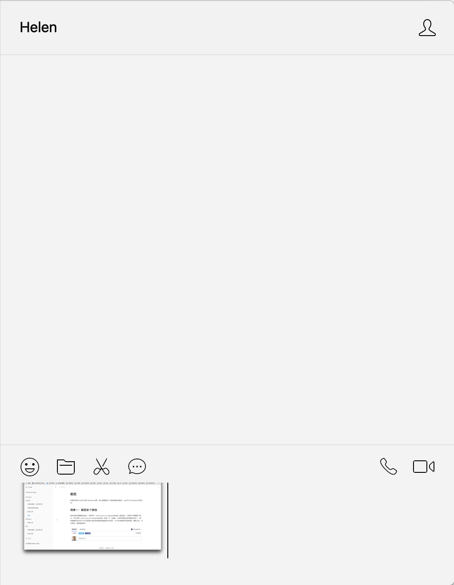
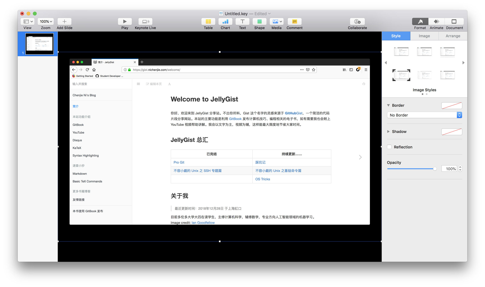

# 截图

如果你觉得 macOS 没有 Windows 好用，那么就截图这个功能我就能说服你，macOS 比 Windows 好用太多！

## 情景一：截图发个微信

首先找到你要截图的窗口，同时按下 `shift+control+command+数字键4` 截选窗口。如果你不想截整个窗口，可以在按 `shift+control+command+数字键4` 后按一下 `空格键`，这样你就能自由地截选内容了。这个快捷键的好处在于它不会把图片保存到桌面或者磁盘的任何地方，它只会将图保存在剪贴板。截图之后，点开微信，直接黏贴即可。

## 情景二：截图放在文稿中

操作同上，以下用 keynote 为例：

## 情景三：截图作为邮件附件

既然要作为附件，那么我们必须把截图保存为文件。快捷键相似，同时按下 `shift+command+数字键4` 就能将截图保存在桌面，注意：这里的快捷键少了个 `control`.

## Enjoy!
