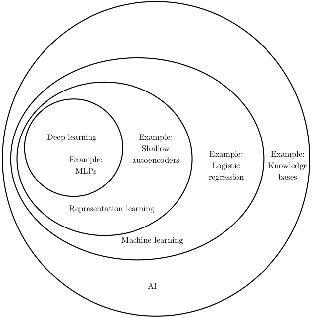

# Welcome to JellyGist

你好，欢迎来到 JellyGist 分享站。不出你所料，Gist 这个名字的灵感来源于 [**GitHub**Gist](https://gist.github.com/)，一个简洁的代码片段分享网站。本站的主要功能是利用 [GitBook](https://www.gitbook.com/) 发布计算机技巧、编程相关的电子书，如有需要我也会附上 YouTube 视频帮助讲解。我会以文字为主，视频为辅，这样能最大限度地节省大家时间。

## JellyGist 总汇

| 已完结 | 持续更新…… |
|-------|----------|
| [Pro Git](https://gist.nichenjie.com/pro-git/) | [踩坑记](https://gist.nichenjie.com/fckd-up/) |
| [不容小觑的 Unix 之 SSH 专题篇](https://gist.nichenjie.com/lets-talk-about-ssh/) | [不容小觑的 Unix 之基础命令篇](https://gist.nichenjie.com/basic-unix-commands/) |
|  | [OS Tricks](https://gist.nichenjie.com/os-tricks/) |

## 关于我

> 最近更新时间：2018年12月28日 于上海虹口

目前多伦多大学大四在读学生，主修计算机科学，辅修数学，专业方向人工智能领域的机器学习。  
Image credit: [Ian Goodfellow](https://github.com/goodfeli)

## 无法正常访问 Google 和 YouTube？

[航空母舰](https://free-ss.me/)
